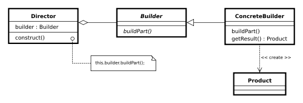

# Builder Pattern

[빌더 패턴](https://en.wikipedia.org/wiki/Builder_pattern)은 이름에서 알 수 있듯이 복잡한 개체를 구성하는 다른 방법입니다. 이것은 **동일한 객체 작성 프로세스를 사용하여 서로 다른 불변 객체를 작성하려는 경우**에만 사용해야 합니다.

토론을 시작하기 전에 본 게시물에서 논의하고자 하는 빌더 패턴은 GOF "Design Patterns"에 언급된 것과 **약간 다르다는 것**을 명확히 하고 싶습니다. 책에는 이렇게 적혀 있습니다.

빌더 패턴은 올바른 수행 순서를 사용하여 복잡한 오브젝트를 단계별로 작성할 수 있는 설계 패턴입니다. 객체 생성은 생성할 객체 유형만 알면 되는 Director 객체에 의해 제어됩니다.

그리고 책에서는 다음의 예를 보여줍니다:



저는 실제 생활 프로그래밍과 응용에서 위의 예를 활용하는 것이 정말 어렵다는 것을 알게 되었습니다. 위의 프로세스는 [**추상 팩토리 패턴**](https://howtodoinjava.com/design-patterns/creational/abstract-factory-pattern-in-java/)과 매우 유사합니다. 특정 타입의 객체에 대한 팩토리(또는 빌더)을 찾은 다음 팩토리에서 해당 객체의 구체적인 인스턴스를 제공합니다. 이 빌더 패턴과 추상 팩토리 패턴 사이의 **단 하나의 큰 차이점**은 빌더가 객체 생성 프로세스에 대한 더 많은 제어 권한을 제공합니다는 점입니다. 그것 말고도, 큰 차이는 없습니다.

> ℹ️ 한 문장에서 추상 팩토리 패턴은 `"What"`에 대한 답이고 빌더 패턴은 `"How"`에 대한 답입니다.

저에게 빌더 패턴은 **[fluent interface](https://en.wikipedia.org/wiki/Fluent_interface)**에 가깝습니다. 일반적으로 method cascading(또는 method chaning)을 사용하여 유연한 인터페이스를 구현합니다.

지금부터, 저는 빌더 패턴에 대해 보다 실제적인 케이스에에 유용하다고 생각하는 방법에 대해 토론하기 시작하겠습니다. 


## Builder Pattern의 정의

Let’s start by a giving a definition to builder pattern:

> Builder pattern aims to “Separate the construction of a complex object from its representation so that the same construction process can create different representations.”

빌더 패턴은 "복잡한 객체의 구조를 그 표현으로부터 분리하여 동일한 구성 프로세스가 다른 표현을 만들 수 있도록 하는 것"을 목표로 합니다.

쉽게 말해 같은 순서의 액션을 처리하여 만들어지는 다양한 객체를 만드는 곳을 특정 짓는 것이다. 디렉터는 내부적으로 특정 객체를 받고 내부에서 생성로직을 처리하여 특정 객체가 만들어진다. 


### GoF 에서의 정의

다음을 분리한다.

- 객체 생성 알고리즘 (= 객체를 생성하는 방법, `Builder` 에서 처리)
- 객체 조립 방법 (= 객체를 표현하는 방법, `Director` 에서 처리)


### Effective Java 3/E 에서의 정의


## Builder Pattern을 어디에 쓸까?

We already know the benefits of **[immutability](https://howtodoinjava.com/java/basics/how-to-make-a-java-class-immutable/)** and immutable instances in application. If you have any question over it, the please let me remind you of `String` class in java. And as I already said, builder pattern helps us in creating immutable classes with large set of state attributes.

Let’s discuss a common problem in our application. In any user management module, primary entity is `User`, let’s say. Ideally and practically as well, once a user object is fully created, you will not want to change it’s state. It simply does not make sense, right? Now, let’s assume, our User object has following 5 attributes i.e. `firstName`, `lastName`, `age`, `phone` and `address`.

In normal practice, if you want to make a immutable `User` class, then you must pass all five information as parameters to constructor. It will look like this:

```
public` `User (String firstName, String lastName, ``int` `age, String phone, String address){``  ``this``.firstName = firstName;``  ``this``.lastName = lastName;``  ``this``.age = age;``  ``this``.phone = phone;``  ``this``.address = address;``}
```

Very good. Now what if only `firstName` and `lastName` are **mandatory** and rest 3 fields are optional. Problem !! We need more constructors.

```
public` `User (String firstName, String lastName, ``int` `age, String phone){ ... }``public` `User (String firstName, String lastName, String phone, String address){ ... }``public` `User (String firstName, String lastName, ``int` `age){ ...  }``public` `User (String firstName, String lastName){ ...  }
```

We will need some more like above. Still can manage? Now let’s introduce our sixth attribute i.e. salary. Now it is problem.

*One way it to create more constructors, and another is to loose the immutability and introduce setter methods. You choose any of both options, you loose something, right?*

Here, builder pattern will help you to consume additional attributes while retaining the immutability of Use class.


## Builder Pattern을 이용한 구현 예제

Below is the coded solution of problem we discussed above. This uses a additional class `UserBuilder` which helps us in building desired User object with all mandatory attributes and combination of optional attributes, without loosing the immutability.

```
public` `class` `User ``{``  ``//All final attributes``  ``private` `final` `String firstName; ``// required``  ``private` `final` `String lastName; ``// required``  ``private` `final` `int` `age; ``// optional``  ``private` `final` `String phone; ``// optional``  ``private` `final` `String address; ``// optional` `  ``private` `User(UserBuilder builder) {``    ``this``.firstName = builder.firstName;``    ``this``.lastName = builder.lastName;``    ``this``.age = builder.age;``    ``this``.phone = builder.phone;``    ``this``.address = builder.address;``  ``}` `  ``//All getter, and NO setter to provde immutability``  ``public` `String getFirstName() {``    ``return` `firstName;``  ``}``  ``public` `String getLastName() {``    ``return` `lastName;``  ``}``  ``public` `int` `getAge() {``    ``return` `age;``  ``}``  ``public` `String getPhone() {``    ``return` `phone;``  ``}``  ``public` `String getAddress() {``    ``return` `address;``  ``}` `  ``@Override``  ``public` `String toString() {``    ``return` `"User: "``+``this``.firstName+``", "``+``this``.lastName+``", "``+``this``.age+``", "``+``this``.phone+``", "``+``this``.address;``  ``}` `  ``public` `static` `class` `UserBuilder ``  ``{``    ``private` `final` `String firstName;``    ``private` `final` `String lastName;``    ``private` `int` `age;``    ``private` `String phone;``    ``private` `String address;` `    ``public` `UserBuilder(String firstName, String lastName) {``      ``this``.firstName = firstName;``      ``this``.lastName = lastName;``    ``}``    ``public` `UserBuilder age(``int` `age) {``      ``this``.age = age;``      ``return` `this``;``    ``}``    ``public` `UserBuilder phone(String phone) {``      ``this``.phone = phone;``      ``return` `this``;``    ``}``    ``public` `UserBuilder address(String address) {``      ``this``.address = address;``      ``return` `this``;``    ``}``    ``//Return the finally consrcuted User object``    ``public` `User build() {``      ``User user = ``new` `User(``this``);``      ``validateUserObject(user);``      ``return` `user;``    ``}``    ``private` `void` `validateUserObject(User user) {``      ``//Do some basic validations to check ``      ``//if user object does not break any assumption of system``    ``}``  ``}``}
```

And below is the way, we will use the `UserBuilder` in our code:

```
public` `static` `void` `main(String[] args) {``  ``User user1 = ``new` `User.UserBuilder(``"Lokesh"``, ``"Gupta"``)``  ``.age(``30``)``  ``.phone(``"1234567"``)``  ``.address(``"Fake address 1234"``)``  ``.build();` `  ``System.out.println(user1);` `  ``User user2 = ``new` `User.UserBuilder(``"Jack"``, ``"Reacher"``)``  ``.age(``40``)``  ``.phone(``"5655"``)``  ``//no address``  ``.build();` `  ``System.out.println(user2);` `  ``User user3 = ``new` `User.UserBuilder(``"Super"``, ``"Man"``)``  ``//No age``  ``//No phone``  ``//no address``  ``.build();` `  ``System.out.println(user3);``}` `Output:` `User: Lokesh, Gupta, ``30``, ``1234567``, Fake address ``1234``User: Jack, Reacher, ``40``, ``5655``, ``null``User: Super, Man, ``0``, ``null``, ``null
```

Please note that above created user object **does not have any setter method**, so it’s state can not be changed once it has been built. This provides the desired immutability.

Sometimes developers may forget to add support for a new attribute to the builder when they add that attribute to the User class. To minimize this, we should enclose the builders inside the class (as in above example) that they build so that it’s more obvious to the developer that there is a relevant builder that needs to be updated too.

> Sometimes I think there should be a **Destroyer pattern** (opposite to builder) which should tear down certain attributes from a complex object in systematic manner. What do you think?


## Existing implementations in JDK

All implementations of [java.lang.Appendable](https://docs.oracle.com/javase/7/docs/api/java/lang/Appendable.html) are infact good example of use of Builder pattern in java. e.g.

[java.lang.StringBuilder#append()](https://docs.oracle.com/javase/7/docs/api/java/lang/StringBuilder.html#append(java.lang.CharSequence)) [Unsynchronized class]

[java.lang.StringBuffer#append()](https://docs.oracle.com/javase/1.5.0/docs/api/java/lang/StringBuffer.html#append(java.lang.CharSequence)) [Synchronized class]

[java.nio.ByteBuffer#put()](https://docs.oracle.com/javase/6/docs/api/java/nio/ByteBuffer.html#put(java.nio.ByteBuffer)) (also on CharBuffer, ShortBuffer, IntBuffer, LongBuffer, FloatBuffer and DoubleBuffer)

Another use can be found in [javax.swing.GroupLayout.Group#addComponent()](https://docs.oracle.com/javase/6/docs/api/javax/swing/GroupLayout.Group.html#addComponent(java.awt.Component)).

Look how similar these implementations look like what we discussed above.

```
StringBuilder builder = ``new` `StringBuilder(``"Temp"``);``String data = builder.append(``1``)``        ``.append(``true``)``        ``.append(``"friend"``)``        ``.toString();``System.out.println(data);``Output:``Temp1truefriend
```


## Builder Pattern의 장점

Undoubtedly, the **number of lines of code increase** at least to double in builder pattern, but the effort pays off in terms of **design flexibility** and much more **readable code**. The **parameters to the constructor are reduced** and are provided in **highly readable method calls**.

Builder pattern also helps minimizing the number of parameters in constructor and thus there is **no need to pass in null for optional parameters** to the constructor. It’s really attracts me.

Another advantage is that Object is always instantiated in a `complete` state rather than sitting in an incomplete state until the developer calls (if ever calls) the appropriate “setter” method to set additional fields.

And I finally I can build **immutable objects** without much complex logic in object building process.


## Builder Pattern의 단점

Though Builder pattern reduce some line of code buy eliminating the need of setter methods, still in **double up total lines** by introducing the Builder object. Furthermore, although client code is more readable, the client code is also more verbose. Though for me, readability weighs more than lines of code.

That’s only disadvantage I can think of.

That’s all for this topic. I will be happy if you share your thoughts as well.

**Happy Learning !!**


## 참고

- [http://en.wikipedia.org/wiki/Builder_pattern](https://en.wikipedia.org/wiki/Builder_pattern)
- [http://www.javaspecialists.eu/archive/Issue163.html](https://www.javaspecialists.eu/archive/Issue163-Book-Review-Effective-Java-2nd-Edition.html)
- [http://en.wikipedia.org/wiki/Fluent_interface](https://en.wikipedia.org/wiki/Fluent_interface)
- [http://martinfowler.com/bliki/FluentInterface.html](https://martinfowler.com/bliki/FluentInterface.html)
- [johngrib 블로그](https://johngrib.github.io/wiki/builder-pattern/)

- Effective JAVA 3/E