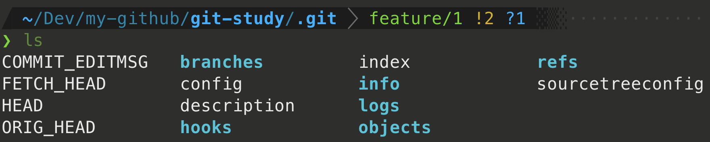
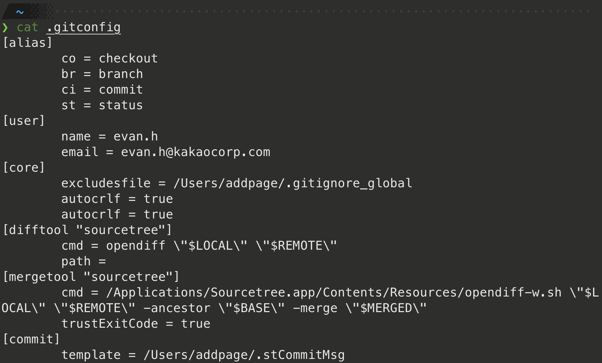
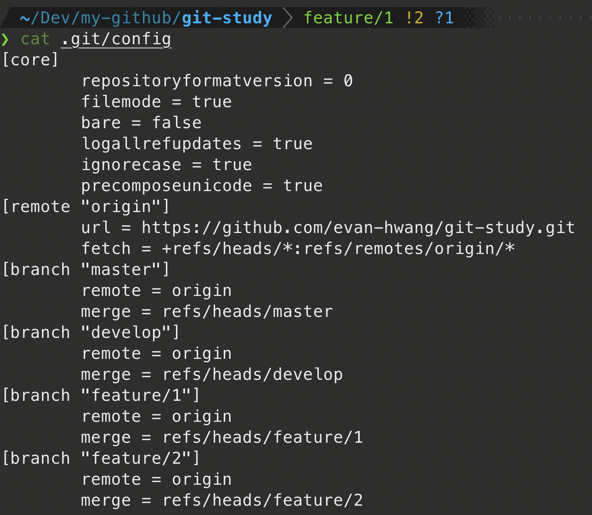

# 1장 시작하기

이 장에서 다루는 내용

- Git 설치 방법
- Git 서버 설정
- Git 탄생 배경
- Git을 사용하는 이유
- Git을 설정하고 사용하는 방법


## 1.1 버전 관리란?

“버전 관리” 는 무엇이고 우리는 왜 이것을 알아야 할까? 버전 관리 시스템은 ==파일 변화를 시간에 따라 기록했다가 나중에 특정 시점의 버전을 다시 꺼내올 수 있는 시스템==이다. 

그래픽 디자이너나 웹 디자이너도 버전 관리 시스템(VCS - Version Control System)을 사용할 수 있다. VCS로 이미지나 레이아웃의 버전(변경 이력 혹은 수정 내용)을 관리하는 것은 매우 현명하다. VCS를 사용하면 각 파일을 이전 상태로 되돌릴 수 있고, 프로젝트를 통째로 이전 상태로 되돌릴 수 있고, 시간에 따라 수정 내용을 비교해 볼 수 있고, 누가 문제를 일으켰는지도 추적할 수 있고, 누가 언제 만들어낸 이슈인지도 알 수 있다. VCS를 사용하면 파일을 잃어버리거나 잘못 고쳤을 때도 쉽게 복구할 수 있다. 이런 모든 장점을 큰 노력 없이 이용할 수 있다.


### 로컬 버전 관리

VCS(Version Control System)을 모르는 사람이라면 로컬 컴퓨터에 디렉토리를 만들고 버전별로 파일을 복사해서 넣었을 것이다. (똑똑한 사람이라면 디렉토리에 시간을 넣을 것이다.) 

이 방법은 간단하고 사용하기 쉽지만 디렉토리를 지우거나 파일을 실수로 고치고, 잘못 복사할 수 있는 여지가 남아있다.

이런 이유로 프로그래머들은 오래전에 로컬 VCS라는 걸 만들었다. 이 VCS는 아주 간단한 데이터베이스를 사용해서 파일의 변경 정보를 관리했다.


그림 1. 로컬 버전 관리.


### 중앙집중식 버전 관리(CVCS)

프로젝트를 진행하다 보면 다른 개발자와 함께 작업해야 하는 경우가 많다. 이럴 때 생기는 문제를 해결하기 위해 CVCS(중앙집중식 VCS)가 개발됐다. CVS, Subversion, Perforce 같은 시스템은 파일을 ==관리하는 서버가 별도==로 있고 클라이언트가 중앙 서버에서 파일을 받아서 ==사용(Checkout)==한다. 수년 동안 이러한 시스템들이 많은 사랑을 받았다.


그림 2. 중앙집중식 버전 관리(CVCS).

CVCS 환경은 로컬 VCS에 비해 장점이 많다. 모두 누가 무엇을 하고 있는지 알 수 있다. 관리자는 누가 무엇을 할지 꼼꼼하게 관리할 수 있다. 모든 클라이언트의 로컬 데이터베이스를 관리하는 것보다 VCS 하나를 관리하기가 훨씬 쉽다.

그러나 이 CVCS 환경은 몇 가지 **치명적인 결점**이 있다. 가장 대표적인 것이 중앙 서버에 발생한 문제다. 만약 서버가 한 시간 동안 다운되면 그동안 아무도 다른 사람과 협업할 수 없고 사람들이 하는 일을 백업할 방법도 없다. 그리고 중앙 데이터베이스가 있는 하드디스크에 문제가 생기면 프로젝트의 모든 히스토리를 잃는다. 물론 사람마다 하나씩 가진 스냅샷은 괜찮다. 로컬 VCS 시스템도 이와 비슷한 결점이 있고 이런 문제가 발생하면 모든 것을 잃는다.


### 분산 버전 관리 시스템

DVCS(분산 버전 관리 시스템)을 설명할 차례다. Git, Mecurial, Bazaar, Darcs 같은 DVCS에서의 클라이언트는 단순히 파일의 ==마지막 스냅샷을 Checkout 하지 않는다. 그냥 저장소를 히스토리와 더불어 전부 복제==한다. 서버에 문제가 생기면 이 복제물로 다시 작업을 시작할 수 있다. 클라이언트 중에서 아무거나 골라도 서버를 복원할 수 있다. Clone은 모든 데이터를 가진 진정한 백업이다.


그림 3. 분산 버전 관리 시스템(DVCS).

게다가 대부분의 DVCS 환경에서는 리모트 저장소가 존재한다. 리모트 저장소가 많을 수도 있다. 그래서 사람들은 동시에 다양한 그룹과 다양한 방법으로 협업할 수 있다. 계층 모델 같은 중앙집중식 시스템으로는 할 수 없는 워크플로를 다양하게 사용할 수 있다.


## 1.2 짧게 보는 Git의 역사

우리네 삶의 삼라만상처럼 Git 또한 창조적 파괴와 활활 타오르는 갈등 속에서 시작됐다.

Linux 커널은 굉장히 규모가 큰 오픈소스 프로젝트다. Linux 커널의 삶 대부분은(1991–2002) Patch와 단순 압축 파일로만 관리했다. 2002년에 드디어 Linux 커널은 BitKeeper라고 불리는 상용 DVCS를 사용하기 시작했다.

2005년에 커뮤니티가 만드는 Linux 커널과 이익을 추구하는 회사가 개발한 BitKeeper의 관계는 틀어졌다. BitKeeper의 무료 사용이 재고된 것이다. 이 사건은 Linux 개발 커뮤니티(특히 Linux 창시자 Linus Torvalds)가 자체 도구를 만드는 계기가 됐다. Git은 BitKeeper를 사용하면서 배운 교훈을 기초로 아래와 같은 목표를 세웠다.

- 빠른 속도
- 단순한 구조
- **비선형적인 개발(수천 개의 동시 다발적인 브랜치)**
- **완벽한 분산**
- Linux 커널 같은 대형 프로젝트에도 유용할 것(속도나 데이터 크기 면에서)

Git은 2005년 탄생하고 나서 아직도 초기 목표를 그대로 유지하고 있다. 그러면서도 사용하기 쉽게 진화하고 성숙했다. Git은 미친 듯이 빨라서 대형 프로젝트에 사용하기도 좋다. Git은 동시다발적인 브랜치에도 끄떡없는 슈퍼 울트라 브랜칭 시스템이다([Git 브랜치](https://git-scm.com/book/ko/v2/ch00/ch03-git-branching) 참고).


## 1.3 Git 기초

Git의 핵심은 뭘까? 이 질문은 Git을 이해하는데 굉장히 중요하다. Git이 무엇이고 어떻게 동작하는지 이해한다면 쉽게 Git을 효과적으로 사용할 수 있다. Git을 배우려면 Subversion이나 Perforce 같은 다른 VCS를 사용하던 경험을 버려야 한다. Git은 미묘하게 달라서 다른 VCS에서 쓰던 개념으로는 헷갈린다. 사용자 인터페이스는 매우 비슷하지만, 정보를 취급하는 방식이 다르다. 이런 차이점을 이해하면 Git을 사용하는 것이 어렵지 않다.


### 차이가 아니라 스냅샷

Subversion과 Subversion 비슷한 놈들과 Git의 가장 큰 차이점은 데이터를 다루는 방법에 있다. 큰 틀에서 봤을 때 VCS 시스템 대부분은 관리하는 정보가 파일들의 목록이다. CVS, Subversion, Perforce, Bazaar 등의 시스템은 각 파일의 변화를 시간순으로 관리하면서 파일들의 집합을 관리한다(보통 *델타 기반* 버전관리 시스템이라 함).


그림 4. 각 파일에 대한 변화를 저장하는 시스템들.

Git은 이런 식으로 데이터를 저장하지도 취급하지도 않는다. 대신 Git은 데이터를 ==파일 시스템 스냅샷의 연속으로 취급하고 크기가 아주 작다.== Git은 커밋하거나 프로젝트의 상태를 저장할 때마다 파일이 존재하는 그 순간을 중요하게 여긴다. 파일이 달라지지 않았으면 Git은 성능을 위해서 파일을 새로 저장하지 않는다. 단지 이전 상태의 파일에 대한 링크만 저장한다. ==Git은 데이터를 **스냅샷의 스트림**처럼 취급==한다.


그림 5. 시간순으로 프로젝트의 스냅샷을 저장.

이것이 Git이 다른 VCS와 구분되는 점이다. 이점 때문에 Git은 다른 시스템들이 과거로부터 답습해왔던 버전 컨트롤의 개념과 다르다는 것이고 많은 부분을 새로운 관점에서 바라본다. Git은 강력한 도구를 지원하는 작은 파일시스템이다. Git은 단순한 VCS가 아니다. [Git 브랜치](https://git-scm.com/book/ko/v2/ch00/ch03-git-branching)에서 설명할 Git 브랜치를 사용하면 얻게 되는 이득이 무엇인지 설명한다.


### 거의 모든 명령을 로컬에서 실행

거의 모든 명령이 로컬 파일과 데이터만 사용하기 때문에 네트워크에 있는 다른 컴퓨터는 필요 없다. 대부분의 명령어가 네트워크의 속도에 영향을 받는 CVCS에 익숙하다면 Git이 매우 놀라울 것이다. Git의 이런 특징에서 나오는 미칠듯한 속도는 오직 Git느님만이 구사할 수 있는 전능이다. 프로젝트의 모든 히스토리가 로컬 디스크에 있기 때문에 모든 명령이 순식간에 실행된다.

예를 들어 Git은 프로젝트의 히스토리를 조회할 때 서버 없이 조회한다. 그냥 로컬 데이터베이스에서 히스토리를 읽어서 보여 준다. 그래서 눈 깜짝할 사이에 히스토리를 조회할 수 있다. 어떤 파일의 현재 버전과 한 달 전의 상태를 비교해보고 싶을 때도 Git은 그냥 한 달 전의 파일과 지금의 파일을 로컬에서 찾는다. 파일을 비교하기 위해 리모트에 있는 서버에 접근하고 나서 예전 버전을 가져올 필요가 없다.

즉 오프라인 상태이거나 VPN에 연결하지 못해도 막힘 없이 일 할 수 있다. 비행기나 기차 등에서 작업하고 네트워크에 접속하고 있지 않아도 커밋할 수 있다(*로컬* 저장소라는 점이 기억나는지). 다른 VCS 시스템에서는 불가능한 일이다. Perforce를 예로 들자면 서버에 연결할 수 없을 때 할 수 있는 일이 별로 없다. Subversion이나 CVS에서도 마찬가지다. 오프라인이기 때문에 데이터베이스에 접근할 수 없어서 파일을 편집할 수는 있지만, 커밋할 수 없다. 매우 사소해 보이지만 실제로 이 상황에 부닥쳐보면 느껴지는 차이가 매우 크다.


### Git의 무결성

Git은 데이터를 저장하기 전에 항상 체크섬을 구하고 그 ==체크섬으로 데이터를 관리==한다. 그래서 체크섬을 이해하는 Git 없이는 어떠한 파일이나 디렉토리도 변경할 수 없다. 체크섬은 Git에서 사용하는 가장 기본적인(Atomic) 데이터 단위이자 Git의 기본 철학이다. Git 없이는 체크섬을 다룰 수 없어서 파일의 상태도 알 수 없고 심지어 데이터를 잃어버릴 수도 없다.

Git은 SHA-1 해시를 사용하여 체크섬을 만든다. 만든 체크섬은 40자 길이의 16진수 문자열이다. 파일의 내용이나 디렉토리 구조를 이용하여 체크섬을 구한다. SHA-1은 아래처럼 생겼다.

```
24b9da6552252987aa493b52f8696cd6d3b00373
```

Git은 모든 것을 해시로 식별하기 때문에 이런 값은 여기저기서 보인다. 실제로 Git은 파일을 이름으로 저장하지 않고 해당 파일의 해시로 저장한다.


### Git은 데이터를 추가할 뿐

Git으로 무얼 하든 Git 데이터베이스에 데이터가 *추가* 된다. 되돌리거나 데이터를 삭제할 방법이 없다. 다른 VCS처럼 Git도 커밋하지 않으면 변경사항을 잃어버릴 수 있다. 하지만, 일단 스냅샷을 커밋하고 나면 데이터를 잃어버리기 어렵다.

Git을 사용하면 프로젝트가 심각하게 망가질 걱정 없이 매우 즐겁게 여러 가지 실험을 해 볼 수 있다. [되돌리기](https://git-scm.com/book/ko/v2/ch00/_undoing)을 보면 Git에서 데이터를 어떻게 저장하고 손실을 어떻게 복구하는지 알 수 있다.


### 세 가지 상태

이 부분은 중요하기에 집중해서 읽어야 한다. Git을 공부하기 위해 반드시 짚고 넘어가야 할 부분이다. Git은 파일을 ***Committed***, ***Modified***, ***Staged*** 이렇게 세 가지 상태로 관리한다.

- Committed란 데이터가 ==로컬 데이터베이스에 안전하게 저장됐다는 것==을 의미한다.
- Modified는 ==수정한 파일을 아직 로컬 데이터베이스에 커밋하지 않은 것==을 말한다.
- Staged란 현재 ==수정한 파일을 곧 커밋할 것이라고 표시한 상태==를 의미한다.

이 세 가지 상태는 Git 프로젝트의 세 가지 단계와 연결돼 있다. Git 디렉토리, 워킹 트리, Staging Area 이렇게 세 가지 단계를 이해하고 넘어가자.


그림 6. 워킹 트리, Staging Area, Git 디렉토리.

- *Working Directory* 
  - 프로젝트의 특정 버전을 Checkout 한 것
- *Staging Area*
  - Git 디렉토리에 있다.
  - 단순한 파일이고 곧 커밋할 파일에 대한 정보를 저장
- *.git directory* 
  - git 프로젝트의 메타데이터와 객체 데이터 베이스를 저장하는 곳
  - 디렉토리 안에 압축된 데이터베이스에서 파일을 가져와서 워킹 트리를 만든다.

Git 디렉토리는 Git이 프로젝트의 메타데이터와 객체 데이터베이스를 저장하는 곳을 말한다. 이 Git 디렉토리가 Git의 핵심이다. 다른 컴퓨터에 있는 저장소를 *Clone* 할 때 Git 디렉토리가 만들어진다.



그림 6-1. Git 디렉토리 구조

==워킹 트리는 프로젝트의 특정 버전을 Checkout 한 것==이다. Git 디렉토리는 지금 작업하는 디스크에 있고 그 디렉토리 안에 압축된 데이터베이스에서 파일을 가져와서 워킹 트리를 만든다.

Staging Area는 Git 디렉토리에 있다. 단순한 파일이고 곧 커밋할 파일에 대한 정보를 저장한다. Git에서는 기술용어로는 “Index” 라고 하지만, “Staging Area” 라는 용어를 써도 상관 없다.

Git으로 하는 일은 기본적으로 아래와 같다.

1. 워킹 트리에서 파일을 수정한다.
2. Staging Area에 파일을 Stage 해서 커밋할 스냅샷을 만든다. 모든 파일을 추가할 수도 있고 선택하여 추가할 수도 있다.
3. Staging Area에 있는 파일들을 커밋해서 Git 디렉토리에 **영구적인 스냅샷으로 저장**한다.

Git 디렉토리에 있는 파일들은 Committed 상태이다. 파일을 수정하고 Staging Area에 추가했다면 Staged이다. 그리고 Checkout 하고 나서 수정했지만, 아직 Staging Area에 추가하지 않았으면 Modified이다. [Git의 기초](https://git-scm.com/book/ko/v2/ch00/ch02-git-basics-chapter)에서 이 상태에 대해 좀 더 자세히 배운다. 특히 Staging Area를 이용하는 방법부터 아예 생략하는 방법까지도 설명한다.


## 1.4 CLI

Git을 사용하는 방법은 많다. CLI로 사용할 수도 있고 GUI를 사용할 수도 있다. 이 책에서는 Git CLI 사용법을 설명한다. ==Git의 *모든* 기능을 지원하는 것은 CLI 뿐==이다. GUI 프로그램의 대부분은 Git 기능 중 일부만 구현하기 때문에 비교적 단순하다. CLI를 사용할 줄 알면 GUI도 사용할 수 있지만 반대는 성립하지 않는다. GUI를 사용하고 싶더라도 CLI가 기본으로 설치되는 도구이기 때문에 CLI기준으로 설명하겠다.

> CLI
>
> 명령 줄 인터페이스(Command-line interface) CLI, 커맨드 라인 인터페이스) 또는 명령어 인터페이스는 가상 터미널 또는 텍스트 터미널을 통해 사용자와 컴퓨터가 상호 작용하는 방식을 뜻한다.


## 1.5 Git 설치

이 공부를 시작하는 시기에 따라 설치 방법이 다를 것이기 때문에 생략하겠다.


## 1.6 Git 최초 설정

Git을 설치하고 나면 Git의 사용 환경을 적절하게 설정해 주어야 한다. 환경 설정은 한 컴퓨터에서 한 번만 하면 된다. <u>설정한 내용은 Git을 업그레이드해도 유지된다.</u> 언제든지 다시 바꿀 수 있는 명령어도 있다.

`git config` 라는 도구로 설정 내용을 확인하고 변경할 수 있다. Git은 이 설정에 따라 동작한다. 이때 사용하는 설정 파일은 세 가지나 된다.

1. `/etc/gitconfig` 파일: 시스템의 모든 사용자와 모든 저장소에 적용되는 설정이다. `git config --system` 옵션으로 이 파일을 읽고 쓸 수 있다. (이 파일은 시스템 전체 설정파일이기 때문에 수정하려면 시스템의 관리자 권한이 필요하다.)

2. `~/.gitconfig`, `~/.config/git/config` 파일: 특정 사용자(즉 현재 사용자)에게만 적용되는 설정이다. `git config --global` 옵션으로 이 파일을 읽고 쓸 수 있다. 특정 사용자의 *모든* 저장소 설정에 적용된다.

   

3. `.git/config` : 이 파일은 Git 디렉토리에 있고 특정 저장소(혹은 현재 작업 중인 프로젝트)에만 적용된다. `--local` 옵션을 사용하면 이 파일을 사용하도록 지정할 수 있다. 하지만 기본적으로 이 옵션이 적용되어 있다. (당연히, 이 옵션을 적용하려면 Git 저장소인 디렉토리로 이동 한 후 적용할 수 있다.)

   

각 설정은 역순으로 우선시 된다. 그래서 ==`.git/config` 가 `/etc/gitconfig` 보다 우선==한다.


### 사용자 정보

Git을 설치하고 나서 가장 먼저 해야 하는 것은 사용자이름과 이메일 주소를 설정하는 것이다. Git은 커밋할 때마다 이 정보를 사용한다. 한 번 커밋한 후에는 정보를 변경할 수 없다.

```bash
$ git config --global user.name "evan.h"
$ git config --global user.email evan.h@kakaocorp.com
```

다시 말하자면 `--global` 옵션으로 설정하는 것은 딱 한 번만 하면 된다. 해당 시스템에서 해당 사용자가 사용할 때는 이 정보를 사용한다. 만약 프로젝트마다 다른 이름과 이메일 주소를 사용하고 싶으면 `--global` 옵션을 빼고 명령을 실행한다.

GUI 도구들은 처음 실행할 때 이 설정을 묻는다.

> ❓설정한 정보를 확인하는 방법
>
> ```bash
> > git config --global --get user.name
> evan.h
> 
> > git config user.name
> evan.h
> ```


### 설정 확인

`git config --list` 명령을 실행하면 설정한 모든 것을 보여주어 바로 확인할 수 있다.

```bash
$ git config --list
user.name=John Doe
user.email=johndoe@example.com
color.status=auto
color.branch=auto
color.interactive=auto
color.diff=auto
...
```

Git은 같은 키를 여러 파일(`/etc/gitconfig` 와 `~/.gitconfig` 같은)에서 읽기 때문에 같은 키가 여러 개 있을 수도 있다. 그러면 Git은 나중 값을 사용한다.

`git config <key>` 명령으로 Git이 특정 Key에 대해 어떤 값을 사용하는지 확인할 수 있다.

```bash
$ git config user.name
John Doe
```


## 1.7 도움말 보기

명령어에 대한 도움말이 필요할 때 도움말을 보는 방법은 두 가지로 동일한 결과를 볼 수 있다.

```bash
$ git help <verb>
$ man git-<verb>
```

예를 들어 아래와 같이 실행하면 `git config` 명령에 대한 도움말을 볼 수 있다.

```bash
$ git help config
```

도움말은 언제 어디서나 볼 수 있다. 오프라인으로도 볼 수 있다. 도움말과 이 책으로 부족하면 다른 사람의 도움을 받는 것이 필요하다. Freenode IRC 서버(irc.freenode.net)에 있는 `#git` 이나 `#github` 채널로 찾아가라. 이 채널에는 보통 수백 명의 사람이 접속해 있다. 모두 Git에 대해 잘 알고 있다. 기꺼이 도와줄 것이다.

Git 명령을 사용하기 위해 매우 자세한 도움말 전체를 볼 필요 없이 각 명령에서 사용할 수 있는 옵션들에 대해서 간략히 살펴볼수도 있다. `-h`, `--help` 옵션을 사용하면 다음과 같이 Git 명령에서 사용할 수 있는 옵션들에 대한 간단한 도움말을 출력한다.

```bash
$ git add -h
usage: git add [<options>] [--] <pathspec>...

    -n, --dry-run         dry run
    -v, --verbose         be verbose

    -i, --interactive     interactive picking
    -p, --patch           select hunks interactively
    -e, --edit            edit current diff and apply
    -f, --force           allow adding otherwise ignored files
    -u, --update          update tracked files
    -N, --intent-to-add   record only the fact that the path will be added later
    -A, --all             add changes from all tracked and untracked files
    --ignore-removal      ignore paths removed in the working tree (same as --no-all)
    --refresh             don't add, only refresh the index
    --ignore-errors       just skip files which cannot be added because of errors
    --ignore-missing      check if - even missing - files are ignored in dry run
    --chmod <(+/-)x>      override the executable bit of the listed files
```


## 참고

- [Pro Git](https://git-scm.com/book/en/v2)