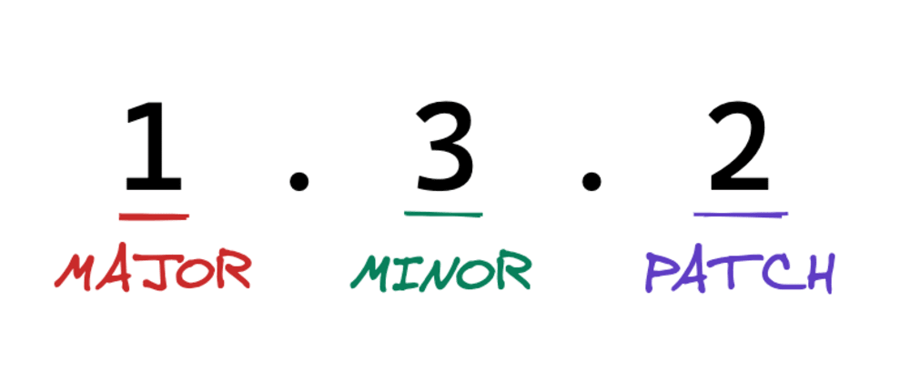

# 시맨틱 버저닝

## 써야하는 이유

## 핵심 가이드

***시맨틱 버저닝***

각 숫자를 순서대로 MAJOR, MINOR, PATCH로 명명하고 다음의 경우 숫자를 늘립니다

1. MAJOR를 늘리는 경우
   - 기존 버전과 호환되지 않게 API를 변경

1. MINOR를 늘리는 경우
   - 기존 버전과 호환면서 새로운 기능을 추가
2. PATCH를 늘리는 경우
   - 기존 버전과 호환되면서 버그를 수정

> ✏️ 위의 형식에 정식 배포 전 버전이나 메타데이터를 위한 라벨을 덧 붙이는 방법도 있습니다.
>
> 
>
> - 1.2.0-beta1
> - 3.0.0-pre-release+meta

## 명세

## BNF(Backus-Naur Form) 문법

## FAQ

## 참고

- [시맨틱 버저닝 2.0.0](https://semver.org/lang/ko/)
- [Baeldung 블로그](https://www.baeldung.com/cs/semantic-versioning)