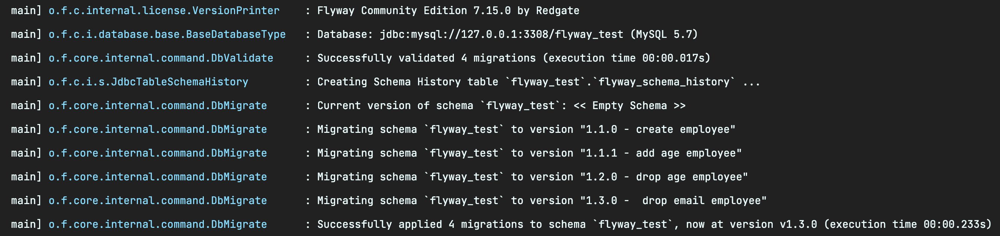

# 버저닝 가이드

## 버저닝이 왜 필요한가요?


***자동차 회사는 바퀴까지 만들지 않는다.***

오늘날 소프트웨어 개발 생태계는 더 이상 모든 것을 만들어내지 않는다. 수 많은 사람들이 서로의 기술과 성과를 이어 받아 오며 협력체계를 구축왔다. 의존성은 이러한 협력체계에서 나오게 된 요소로, 다른 사람들이 만들어온 기능을 다시 만들 필요 없이 손쉽게 가져와 재활용하는 방식으로 소프트웨어는 발전했다. 

하지만 이렇게 여러 사람에게 이용되는 패키지가 새롭게 업데이트될 때, 생각보다 다양한 문제에 직면하게 되었다. 기능의 사용법을 바꾸어버리거나 동작 방식의 변경 같은 변화들은 그에 의존하는 다른 소프트웨어를 의도대로 동작하지 못하게 하므로, 새로운 변화와 기존의 것을 구분할 필요가 생겼다. 

**버전이라는 개념은 소프트웨어를 사용하는 컨슈머가 패키지의 변화를 구분하기 위해 사용하기 시작했다.**


## 그럼 어떻게하면 되나요?

***"그까이꺼 대충 그냥 숫자 세개 사이에 점 찍고 하나씩 올리면 되는거 아니야?"***

버저닝에 대한 글을 찾아보면  `MAJOR.MINOR.PATCH` 규칙을 제안하는 것을 많이 볼 수 있다. 

저 규칙을 보면 이런 생각을 하게 된다.

> 🤔 `MAJOR`를 올리려니 뭔가 거창한 개발을 한 것 같아보이기도 하고, 그럼 `MINOR`를 올릴까? `PATCH`를 올릴까? 그냥 `PATCH`부터 올리다가 10이 넘어가면 `MINOR`를 올리자! 

물론 우리만 이렇게 생각하고 버저닝을 하는 것은 아니고 다른 여러 오픈소스 기여자들도 그렇게 해왔다. 

그러다보니 버전명 작성 방식에대한 기준이 각 패키지마다 제각각 다른 것이 문제였다. 누군가는 API 호환성이 깨지면 `0.0.1`에서 `0.0.2`로 올렸고, 누군가는 `1.0.0`에서 `2.0.0`으로 올리면서 선행 배포 버전과 정식 버전의 구분 방법 등 모든 소프트웨어, 패키지는 저마다 기준을 가지게 되었다. 😂 


### 시맨틱 버저닝


[시맨틱 버저닝](http://semver.org/)은 Github의 공동창업자인 [톰 프레스턴 워너](http://tom.preston-werner.com/)가 위의 문제를 해결하기 위해 기존의 현안을 모아 만든 제안이다. 주요한 규칙은 다음과 같다.

- `MAJOR` 버전은 기존 API와 하위 호환되지 않는 변화가 추가될 때 올린다.
- `MINOR` 버전은 기존 API와 하위 호환되는 새로운 기능이 추가되었을 때 올린다.
- `PATCH` 버전은 기존 API와 하위 호환되는 버그 수정이 추가되었을 때 올린다.
- 릴리즈나 배포, 메타데이터에 대한 추가 정보는 `Label` 위치에 확장해서 사용할 수 있다. (메타데이터에 대해 더 알고 싶다면 [참고](https://web-front-end.tistory.com/24))

```
"dependencies": {
    "@vue/cli-plugin-babel": "^3.12.1",
    "@vue/cli-plugin-eslint": "^4.2.3",
    "@vue/cli-plugin-unit-jest": "^4.2.3",
  	...
}
```

***시맨틱 버저닝을 차용한 npm의 package.json***

이 외에도 세세한 규칙이 있다. 중요한 것은 이렇게 정의된 규칙을 통해서 내 오픈소스 또는 타인의 오픈소스를 언제 호환성을 맞춰도 될지에 대한 힌트를 제공하게된다. 👍


## 어디에 적용하나요?


***시맨틱버저닝 장착!***

자 이제 시맨틱 버저닝이라는 무기를 장착했다. 그럼 이제 버전이 필요한 곳을 찾아보자.

- 유저들이 다운 받는 앱스토어의 앱 버전
- 컨슈머들에게 제공하는 서비스의 API 버전
- 데이터베이스 스키마의 버전 관리를 위한 DB Schema 버전

버저닝이 필요한 각 요소에 시맨틱 버저닝을 넣어보자.

> 🤔 클라이언트 앱에는 API라는게 없는데 버그 수정 시 `PATCH`를 올리면 될까? 그럼 `MAJOR`는 새로 다운 받아야할 때? 그리고 Schema 버전은 컨슈머가 개발자인데 어떻게 처리하면 될까?

막상 시맨틱 버저닝 명세에 써있는 규칙대로 명세를 해보려니 앱 버저닝과 Schema 버저닝에는 딱 들어맞지 않는 느낌이 든다. 그렇다 각각 다른 방법론이 적용되어야한다. 정확한 표준은 없지만 각각에 대해 가이드를 제안해보겠다. 🧐


## 버저닝 가이드

### 가이드 이전 상태


***이말년의 혼세마왕***

1. 버저닝 가이드가 따로 없다.

2. 특히 클라이언트 개발자와 백엔드 개발자의 소통 구간인 API에 버저닝에 대한 규칙이 따로 없다.

   > **ㄱ. 배포 타이밍을 맞춰야함**
   >
   > 🗣 백엔드 : 이번에 스키마 변동으로 인해 API 스펙이 좀 변했어요. 배포 맞출 때 같이 맞춰요.
   >
   > 🗣 클라이언트 : 네 클라이언트 작업 완료되면 말씀드릴게요. 
   >
   > **ㄴ. 호환성 여부를 알려면 물어봐야함.**
   >
   > 🗣 클라이언트 : 이번 배포가 클라이언트에 영향이 있을까요?
   >
   > 🗣 백엔드 : 잠시만요, 영향 없을 것 같아요. 배포하겠습니다.

3. Schema 버저닝을 API 버저닝처럼 쓰고 있으며, Schema 버저닝에 대한 규칙도 정해져있지 않다.

   > 🗣 백엔드 : `1.3.9` 마일스톤이 끝났는데, `1.4.0` 으로 올릴까요?

4. 앱 버저닝, API 버저닝 작업 및 릴리즈 노트 작업이 수동으로 이뤄지고 있다.

   - 그러다보니 버전을 관리하는 책임자가 생기게 되었다.

5. Schema 버전 별 마이그레이션을 수동으로 확인 후 각 환경에 배포하고 있다.

   > 🗣 백엔드 : OO씨 STAGE 환경에는 스키마가 적용되었는데, VIEWER 환경에는 적용이 안되었네요 확인 부탁합니다. 


### APP 버저닝 제안


***순서대로 카카오톡, 인스타그램, 리그오브레전드의 버전기록***

앱 버저닝의 컨슈머는 실 사용 유저이다. 즉 대부분 시맨틱 버저닝을 모르기 때문에 가장 기호대로 사용하고, 그래도 되는 영역이라고 생각한다. 시맨틱 버저닝을 따라간다면 `Major`로는 대규모 패치(앱 재설치, 업데이트), `Minor` 는 기능 추가, `Patch`는 버그 수정으로 사용하는 편으로 보인다.


### API 버저닝 제안

시맨틱 버저닝이라는 개념 자체가 패키지, 라이브러리, 오픈소스 서비스의 호환성 표준을 위해 정해졌기 때문에, 버저닝 하면 가장 먼저 떠오르는 게 API 버저닝이 아닐까 싶다. 기본적으로 위에서 다룬 시맨틱 버저닝을 사용하는 것을 추천한다. 하지만 출시 전 너무 많은 feature로 인해 버전이 `3.1.93` 이런 식으로 늘어나는 것을 보기 힘들다면 맨 앞에 `Milestone` 단계를 두는 것도 고려해볼 수 있다. 예를들어 첫 출시 이전에는 `3.3.1.93` 과 같은 버저닝을 진행하다가, 공개 이후에는 `1.0.0`부터 시작하는 것이다. 

#### 자동화 고려 사항

추가로 이 버저닝 작업 자체도 다음과 같은 수고가 든다.

> 🤕 한번의 정식 릴리즈를 진행하려면 
>
> 1. `main` 브랜치에서 `x.x.x-rc` 브랜치 생성 후 이동
> 2. 테스팅 및 린팅 수행
> 3. CI, CD 진행
> 4. Changelog 나 릴리즈 노트 작성
> 5. Tagging 및 upstream에 push
> 6. Draft a new release를 통해 push된 태그를 [릴리즈로 등록](https://docs.github.com/en/repositories/releasing-projects-on-github/managing-releases-in-a-repository)

CI와 CD 사이 또는 CI/CD 직전에 사람의 개입이 필요하므로 릴리즈 작업은 부담과 스트레스, 사전 지식을 수반한다. 

"그냥 commit만하면 알아서 릴리즈 되었으면" 하는 바람은 오픈소스인 [commitizen](https://github.com/commitizen-tools/commitizen)과 [sementic release](https://github.com/semantic-release/semantic-release)를 활용해 이룰 수 있다. 자세한 방법은 [링크](https://deepbaksu.github.io/2021/05/29/semantic-release/) 참고.


***conventional commit 스펙을 준수하는 commitizen***


***commit으로부터 CHANGELOG, 릴리즈를 생성하는 sementic release***


### DB Schema 버저닝 제안

***"앗! DB schema 관리 신발보다 싸다"***

코드의 형상관리라고 하면 자연스럽게 Git이 떠오른다. 마찬가지로 DB Schema도 코드로 버전관리가 가능하다. 

DB Schema를 코드로 관리했을 때 얻을 수 있는 이점은 다음과 같다.

- DB schema 의 변경 이력이 남는다.
  - DB schema 도 어플리케이션 코드처럼 이력이 관리되어야 할 대상이다. 예를 들어 뒤늦게 DB schema 에서 어떤 문제가 발견되었다면, 이력이 남아있지 않을 때와 남아있을 때의 문제 해결 난이도는 많이 다를 것이다.
- DB schema 변경 작업이 더 안전해진다.

- DB migration 작업 자체를 코드로 할 수 있게 된다. 

  - 

    ***여러 환경에 마이그레이션해야하는 DB Schema***

    사람이 직접 배포하는 대신 코드로 실행하기 때문에 모든 개발자가 Schema 변경 방법을 알 필요도 없고, 실수할 여지가 줄어들고, 배포 시에 자동화도 가능하다.

- 더 많은 사람이 협업하기 쉬워진다.

  - 코드로 관리가 되기 때문에 서로 리뷰를 받을 수 있어 미리 문제를 파악하기 좋고, 실제 환경과 동일한 local 환경을 구축하기 쉬워져서 local 에서 개발하기가 훨씬 수월해진다.


#### 버저닝 포맷

DB Schema 버저닝은 **외부 컨슈머들에게 공개되는 정보가 아니기 때문에 정해진 표준이 없지만** 다음과 같이 두 가지 포맷을 추천해본다.

1. 시맨틱 버저닝

   - ex) V1_1_0__create_user.sql

   - [스키마 버전도 시맨틱?](https://medium.com/@francesc/serialization-versioning-the-semantic-versioning-for-databases-eea5aece0355)

   - [SnowPlow의 SchemaVer](https://snowplowanalytics.com/blog/2014/05/13/introducing-schemaver-for-semantic-versioning-of-schemas/)

2. 타임스탬프 방식

   - ex) V20220517155739__create_user.sql

​		

#### 자동화 고려사항 - Flyway

위에서 API 버저닝 자동화 다뤘듯 DB Schema 배포 작업도 많은 수고가 든다. 

> 🤕 배포를 진행하려면
>
> 1. `local` 환경에서 버저닝 SQL 파일을 작성한다.
> 2. 로컬에 적용 후 테스트
> 3. 어디까지 배포했는지 버전을 기억하기 위해 날짜를 적거나, 테이블에 기록하기 위한 쿼리를 작성한다.
> 4. CI, CD 진행
> 5. 배포된 환경에 어디까지 DB Schema가 적용됐는지 패치 노트나 커밋을 확인한다.
> 6. 마이그레이션 진행
> 7. 각 환경마다 5~6 반복
>
> (물론 JPA의 ddl-auto도 있지만, 이는 DDL을 직접 생성해주지 않기도 하고, create 옵션 시 기존 데이터를 다 날리기도 하는 이슈 때문에 제외하자.)

Flyway는 이러한 수고를 자동화해주는 DB Schema 형상관리 툴이다. 


##### 사전 작업

이를 사용하기 위해선, 

1. DB Schema를 구성하는 버전 별 `.sql` 파일들의 디렉토리가 필요하다.
2. Flyway의 syntax에 맞게  `.sql` 파일들의 이름을 설정해야 한다.
3. Flyway를 사용할 DataSource 의 정보를 설정해주어야 한다.
4. Flyway 환경 설정을 Gradle 플러그인 또는 application.yml를 통해 해줘야한다. (다른 방법도 존재하긴 함)


**1. sql 디렉토리 설정**

```yaml
spring:
    flyway:
        locations: classpath:db/migration
```

먼저, `.sql` 파일들의 경로를 지정해주어야 합니다. 기본 경로는 위와 같으며 application 설정 파일에서 간단하게 설정이 가능합니다.


**2. sql 파일 네이밍 규칙 선정**


***Versioned Migrations 규칙***

- Prefix는 V, U, R의 3가지 종류로 나뉘어 진다.

  - V (Versioned): 현재 버전을 새로운 버전으로 업데이트 하는 경우

  - U (Undo): 현재 버전을 이전 버전으로 되돌리는 경우 (유료 버전에서만 지원)

  - R (Repeatable): 버전에 관계 없이 매번 실행하는 경우 ([참고](https://blog.gangnamunni.com/post/introducing-flyway/)) 

- Version은  `1` ,  `2` ,  `1.1` , `20220102` 와 같이 다양하게 표현이 가능하다.
  - 중요한 점은, SQL을 새로 작성한다면 SQL 스크립트의 버전을 이전보다 높게 적어야만 적용된다. (`1.0` → `2.0` → `2.1` →  `1.1`(예외 발생))
  
  - 
  
    ***Intellij의 Flyway Migration Creation***
  
    Creation 툴을 이용하면 `V20220517155739__create_user` 형태로 timestamp 버전 값을 자동으로 넣어준다.
- Separator 는 반드시 `__` (언더바 2개)로 구성된다.

- Description 은 문맥에 맞추어 자유롭게 작성 가능하며 공백은  `_` (언더바 1개)로 표현할 수 있다. (`V1.1__init_users_table.sql`)


**3. DB 접속 정보**

- Spring Boot 프로젝트에선 스프링에 설정된 datasource 값을 자동으로 인식한다.

  ```yaml
  spring:
    datasource:
      url: jdbc:mysql://localhost:13306/flyway_test
      username: root
      password: pwd
  ```

-  `application.yml` 에 명시적으로 DataSource 값을 설정해줄 수도 있다.

  ```yaml
  spring:
    flyway:
      url: jdbc:mysql://localhost:13306/flyway_test
      user: root
      password: pwd
  ```

- 스프링 Configuration 클래스를 통해 직접 Bean을 생성하면서 DataSource 값을 설정할 수 있다.

  ```java
  @Configuration
  class FlywayConfig { 
      @Bean
      fun flyWay(datasource: DataSource): Flyway =
          Flyway.configure().dataSource(datasource).load()
  }
  ```


**4. 환경설정**

- Gradle 플러그인 설정을 통해 수동 명령을 내릴 수 있다.

  ```groovy
  plugins {
    id 'org.springframework.boot' version '2.6.7'
    id 'io.spring.dependency-management' version '1.0.11.RELEASE'
    id 'java'
    id 'org.flywaydb.flyway' version "7.15.0" // 1) flyway 플러그인 설정
  }
  
  group = 'com.example'
  version = '0.0.1-SNAPSHOT'
  sourceCompatibility = '11'
  
  configurations {
    compileOnly {
      extendsFrom annotationProcessor
    }
  }
  
  repositories {
    mavenCentral()
  }
  
  dependencies {
    implementation 'org.springframework.boot:spring-boot-starter-data-jpa'
    implementation 'org.flywaydb:flyway-core:7.15.0' // 2) flyway 의존성 설정
    runtimeOnly 'mysql:mysql-connector-java'
  }
  
  tasks.named('test') {
    useJUnitPlatform()
  }
  
  flyway {  // 3) flyway 플러그인 환경설정
    url = 'jdbc:mysql://localhost:3308/flyway_test'
    user = 'root'
    password = 'root'
    driver = 'com.mysql.cj.jdbc.Driver'
  }
  ```

  ***build.gradle***

  

  ***gradle plugin 명령 목록***

- `application.yml` 파일에 환경 설정할 수 있다.

  ```yml
  spring:
    datasource:
      driver-class-name: com.mysql.cj.jdbc.Driver
      url: jdbc:mysql://127.0.0.1:3308/flyway_test
      username: root
      password: root
  
    flyway:
      baseline-on-migrate: true # flyway_shcema_history 히스토리 테이블 생성 여부
      baseline-version: 1 # schema가 없을 때 migrate 시 사용되는 기준 값
      enabled: true # BootRun 때에 마이그레이션 파일 경로에 있는 파일을 읽어서 반영한다.
    
    jpa:
      hibernate:
        ddl-auto: none
      generate-ddl: true
  ```

  

##### 실습

4가지 버전의 sql을 작성해보자.

```sql
CREATE TABLE IF NOT EXISTS `employee`
(
    `id`            int NOT NULL AUTO_INCREMENT PRIMARY KEY,
    `name`          varchar(20),
    `email`         varchar(50),
    `date_of_birth` timestamp

) ENGINE = InnoDB
  DEFAULT CHARSET = UTF8;
```

***V1_1_0__create_employee.sql***

`employee` 테이블 생성


```sql
ALTER TABLE employee
    ADD COLUMN `age` BIGINT(20) NULL COMMENT '나이' AFTER `email`;
```

***V1_1_1__add_age_employee.sql***

`employee` 테이블에 `age` 필드 추가


```sql
ALTER TABLE employee
    DROP COLUMN `age`;
```

***V1_2_0__drop_age_employee.sql***

`employee` 테이블에서 `age` 필드 제거


```sql
ALTER TABLE employee
    DROP COLUMN `email`;
```

***V1_3_0___drop_email_employee.sql***

`employee` 테이블에서 `email` 필드 제거




***어플리케이션 실행 로그 중 Flyway 관련 로그***

그리고 어플리케이션 실행하면 위와 같이 Flyway가 자동으로 `db/migration` 경로로부터 `.sql` 파일을 읽어와 마이그레이션을 진행한다.


***flyway_schema_history 테이블 추가됨***

데이터베이스를 확인해보면 Flyway가 DB Schema 버전을 관리하는 테이블을 만든 것을 확인 할 수 있다.


***flyway_schema_history 테이블***

해당 테이블에는 각 버전 별 작업 내용이 담겨있다. 이제 `1.3.0` 이후의 Schema가 추가되면 그 Schema부터 마이그레이션을 자동으로 진행해줄 것이다.


이로서 Flyway를 사용함으로써 `.sql` 파일들을 버전별로 나누어 관리할 수 있게 되었고, DB 서버에 직접 접근해서 쿼리를 날리지 않아도 마이그레이션을 통해 DB 정보를 업데이트 할 수 되었다.


##### 적용 중 발생한 이슈

1. Flyway는 MySQL 8.0 미만을 사용하기 위해선 유료화 모델을 사용해야한다는데?
   - Flyway 8.0 이상 부터는 맞는 말이다. 7.5.1 미만 버전은 MySQL 5.7을 무료 모델로 쓸 수 있기 때문에 해당 버전을 사용하자. ([참고](https://beaniejoy.tistory.com/58))
2. 카카오 Prod 환경에서는 수동 배포를 진행해야한다는데? 
   - 스프링의 환경별 설정을 통해 환경 별로 마이그레이션 정책을 사용하자. 또는 Flyway 도커 컨테이너를 별도로 띄우는 방법도 있다.
3. Flyway 대항마로 LiquiBase라는 것도 있던데?
   - 기능은 더 풍부하지만(무료 버전에서 rollback 지원) 사용법이 좀 더 어렵고 SQL이 아닌 XML 기반으로 버저닝이 진행되어야한다. 반면 flyway는 plain SQL 을 사용한다. 그래서 flyway를 선택하는 것이 좋아 보인다. 학습비용이 적어야만 누가 와도 해낼 수 있고 그 결과로 팀이 쉽게 스케일 할 수 있기 때문이다.


##### 추가로 고려해봐야할 이슈

1. Flyway는 Seed 데이터를 설정할 수 있다던데?
   - 서버에 새로 마이그레이션을 진행할 때 초기 데이터를 설정해야할 경우가 있다. 이런 경우 Seed 데이터를 설정 할 수 있는 기능을 제공하고 있다. ([참고](https://blog.gangnamunni.com/post/introducing-flyway/))
2. 스프링에 너무 의존성이 생기는 방식이 아닌가?
   - 클라우드 환경에서 도커 Flyway 컨테이너를 띄워서 관리도 가능하다. ([참고](https://beaniejoy.tistory.com/58))
3. 클라우드 환경에서 버저닝된 API를 어떻게 유저들에게 적용할까?
   - 다음의 링크들 참고
     - [API Change Strategy](https://nordicapis.com/api-change-strategy/)
     - [클라우드에서 유저별 버저닝](https://blog.bitsrc.io/releasing-different-web-app-features-for-different-users-bef383eae698)

4. 이미 작성한 sql문을 변경하면 checksum mismatch 예외가 발생하는데?

   - ```bash
     Caused by: org.flywaydb.core.api.exception.FlywayValidateException: Validate failed: Migrations have failed validation
     Migration checksum mismatch for migration version 1.1
     -> Applied to database : 415328500
     -> Resolved locally    : -1948301275. Either revert the changes to the migration, or run repair to update the schema history.
     ```

     ***Migration checksum mismatch 에러***

     sql의 checksum을 flyway_schema_history가 들고 있기 때문에 변경하지 말아야하고, 변경한 경우 checksum을 강제로 수정해서 적용할 수는 있다.

5. 같은 `.sql` 을 바꾸는 경우 어떻게 적용을 해야할까?

   - upstream 브랜치에서 코드를 땡겨왔는데, 내가 작성하고 있는 `.sql` 파일과 같은 버전의 파일이 있다면 내 버전을 하나 뒤로 미루자.


## 결론

- APP 버저닝은 클라이언트로부터
- API 버저닝 전략을 세우고 자동화하자.
- DB Schema 버저닝 전략을 세우고 자동화하자.
- 작게 시작하고 이슈는 협의하에 가이드에 추가하자.


## 참고

- [버저닝 설명이 좋은 블로그](https://spoqa.github.io/2012/12/18/semantic-versioning.html)

- [클라이언트 앱 버저닝 참고자료](https://mdapp.medium.com/mobile-app-versioning-a-numbers-game-f1ea9dbd1ded)
- [API에 버저닝 정보 녹이기](https://github.com/quick-starters/web-api-design/blob/a9557adee1734016722586d24241b017b1a447d9/book/%EC%9B%B9_API_%EB%94%94%EC%9E%90%EC%9D%B8/09_API_%EB%94%94%EC%9E%90%EC%9D%B8_%EB%B0%9C%EC%A0%84%EC%8B%9C%ED%82%A4%EA%B8%B0/README.md)

- [메인테이너가 들려주는 오픈소스 개발기](https://deview.kr/data/deview/session/attach/1500_T1_%E1%84%87%E1%85%A1%E1%86%A8%E1%84%8C%E1%85%A2%E1%84%89%E1%85%A5%E1%86%BC_%E1%84%80%E1%85%B5%E1%86%BA%E1%84%92%E1%85%A5%E1%86%B8%204.4K%20%E1%84%89%E1%85%B3%E1%84%90%E1%85%A1%20billboard.js%20%E1%84%86%E1%85%A6%E1%84%8B%E1%85%B5%E1%86%AB%E1%84%90%E1%85%A6%E1%84%8B%E1%85%B5%E1%84%82%E1%85%A5%E1%84%80%E1%85%A1%20%E1%84%83%E1%85%B3%E1%86%AF%E1%84%85%E1%85%A7%E1%84%8C%E1%85%AE%E1%84%82%E1%85%B3%E1%86%AB%20%E1%84%8B%E1%85%A9%E1%84%91%E1%85%B3%E1%86%AB%E1%84%89%E1%85%A9%E1%84%89%E1%85%B3%20%E1%84%80%E1%85%A2%E1%84%87%E1%85%A1%E1%86%AF%E1%84%80%E1%85%B5.pdf)

- [컨벤셔널 커밋과 시맨틱 릴리즈 적용기](https://leesuhyung.medium.com/cra-custom-template-%EC%83%9D%EC%84%B1-npm-%EC%97%90-%EA%B2%8C%EC%8B%9C-%EB%B0%8F-ci-cd-%EA%B5%AC%EC%84%B1%ED%95%98%EA%B8%B0-2-f937ffc12764)
