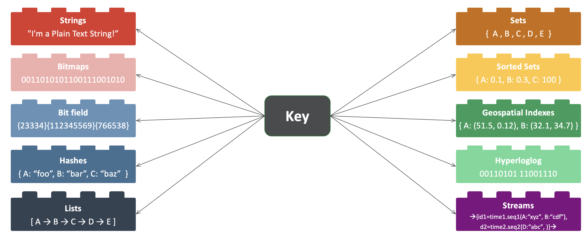

# Redis in Spring Framework

## Spring Data Redis

## RedisTemplate

### RedisOperations

RedisTemplate의 `opsFor*` 메소드들은 특정 컬렉션의 커맨드(Operation)을 호출할 수 있는 기능을 모아둔
`*Operations` 인터페이스를 반환합니다.

| 메소드명      | 반환 오퍼레이션 | 관련 Redis 자료구조 |
| :------------ | :-------------- | :------------------ |
| opsForValue() | ValueOperations | String              |
| opsForList()  | ListOperations  | List                |
| opsForSet()   | ListOperations  | List                |
| opsForList()  | SetOperations   | Set                 |
| opsForZSet()  | ZSetOperations  | Sorted Set          |
| opsForHash()  | HashOperations  | Hash                |

## 참고

- [Baeldung, Spring Data Redis Tutorial](https://www.baeldung.com/spring-data-redis-tutorial)

- [redis labs](https://redislabs.com/)

  

## 관련 문서

- [RedisLab MeetUp](./docs/redisstreams-pipelinemeetup.pdf)